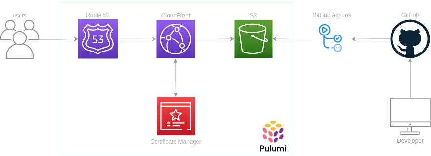
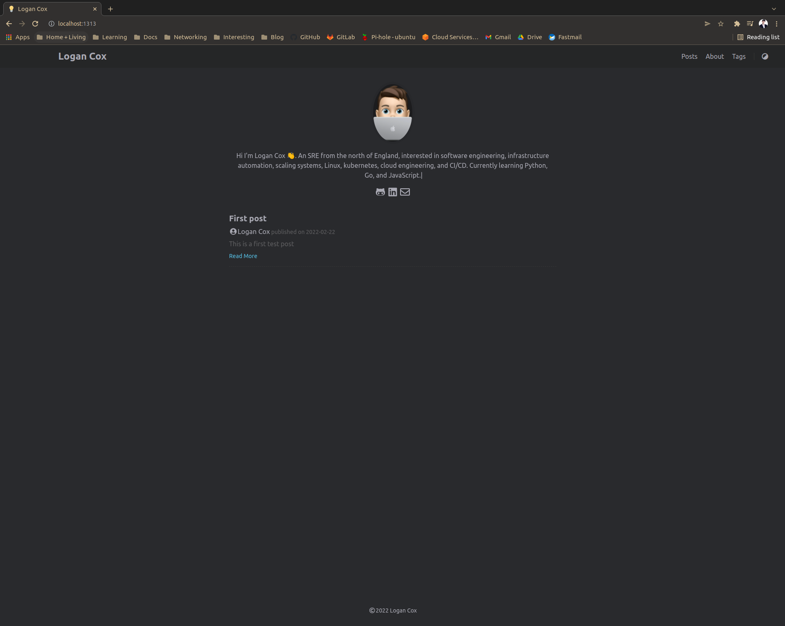

# Personal Site
A personal site to hold information about myself and blog posts

## Creating a automated serverless website using AWS, GitHub and Terraform.
I wanted to create a personal website where I could display information about myself and post technical writing surrounding technologies or ideas I am interested in. For me the site had to be serverless, easy to manage posts and have fully automated deployments. The advantage of this is the less time I have to spend building the website or managing servers the more time I can spend on developing my engineering skills or studying for various certifications. This first led me to `Hugo`. A lightweight static site generator written in Go that allows me to control the site through `markdown`  and a `configuration.toml` file! On build `Hugo` will publish an artifact to `public/` in your site root directory. This is the contents for your static site and where your `index.html` will be placed. In fact, it's where you are reading this post from now.

So now I have a framework. I've met some of my requirements outlined in my introduction. I still needed a serverless platform to deploy to. Amazon S3 meets the requirement in this scenario, whilst S3 is traditionally used for object level cloud storage it also has a static website hosting setting for your S3 bucket. We can store our artifact produced by Hugo in a bucket and have S3 serve the contents. This works because the contents of this bucket are static web content. Anything that utilizes server-side processing such as PHP or Python would not be compatible with this feature.

For deployments I can use the same platform where I am storing the source code for this website, GitHub. The actions feature of GitHub can create automations that will run our `Hugo` build and then push our atrefact to our S3 Bucket. 

During our deployment I also want to deploy our infrastructure then deploy our content to the bucket. For this I opted for Terraform, a widley popular infrastructure as code tool to manage my resources in AWS via code. This give us the advantage of having the configuration of our entire infrastucutre sotred in a version controll system. Then from this we can execute automations to deploy our configurations programitaclly. Also giving us the advantage of rebuilding the entire configuration at any point, itterate on changes faster and taking advantage of terraforms build in idempotency. 



## Installing and configuring Hugo
I needed to install Hugo and its dependency `Go`.
- Install [Go](https://go.dev/doc/install).
- Install [Hugo](https://gohugo.io/getting-started/installing/).

After installing hugo and configuring my theme by adding several configurations to my `config.toml` in the root of the site.  I am able to write posts in  `markdown`, this is made even easier by running `hugo new posts/post.md`. Then test the configurations with `hugo serve` and run the site locally on the default hugo port so when I navigate to `127.0.0.1:1313` I am presented with my site with my first post.

### First result
As you can see from the minimal setup I have the ability to post content to my site with a nice theme.


## Building out the infrastrcuture

As defined in the architechure diagram above, everything in the blue box we are going to be deploying using terraform.

- S3 bucket
- Cloud Front distrobution 
- Route53 DNS records
- Certificate Manager

#### Getting Started with Terraform

The first task here is to [install terraform](https://go.dev/doc/install). When we have installed terraform and verified with `terraform -version` we can continue. To start we will strucutre the files to group resrouces that deploy resrouces for that service. 
```bash 
.
├── certificate_manager.tf
├── cloud_front.tf
├── env.tfvars
├── main.tf
├── route_53.tf
├── s3.tf
└── variables.tf
```
You can see here that there that there are some files that are not represented by `AWS` services.
- main.tf - Where we will store our state file and provider configurations.
- variables.tf - Where we will declare all of our terraform variables with their type contraints and defaults. 
- env.tfvars - Setting the values that corespond to our variables declared in variables.tf

In our `main.tf` we will need to configure our backend where our state file will be stored. The state file is used as a srouce of truth between your resrouces that are deployed and resrouces declared as a part of your configuration. When we create a resrouces as a part of our code terraform, will sotre the configuration for that resource in the state file. In this instance we have already created an S3 bucket in `AWS` that will host the state file.

```HCL
terraform {
    backend "s3" {
        bucket = "logancox-blog-terraform"
        region = "eu-west-1"
        key    = "state/main"
    }
}
```

To declare variables in terraform we will use a `variables.tf` file a good example will be the bucket name where we will host our build. We set the type to string and add a description, I will not add a default here as I know we are passing in a `tfvars` file and `S3` buckets must be globaly unique (we will add a prefix when we create the bucket).

```HCL
variable "blog_bucket_name" {
    description = "Our main blog bucket where contents are served from"
    type        = string
}
```

Finaly we set the value of the variable in the `tfvars` file

```
blog_bucket_name = "logan-cox-blog-artifacts"
```

### Building the S3 Bucket

The place we are going to store our websites contents is an S3 bucket. So frist we will need to create a bucket with a random prefix to ensure it is globaly unique. We will define the name and tags we wish to apply to the bucket.

```HCL
resource "random_string" "random" {
    length           = 4
    special          = false
}

resource "aws_s3_bucket" "blog" {
    bucket = "${random_string.random.result}-${var.blog_bucket_name}"
    tags   = var.global_tags
}
```

Finally applying security restructions to be used in a later section where we will allow bucket access only from our CloudFront OAI

```
data "aws_iam_policy_document" "blog" {
    statement {
        actions   = ["s3:GetObject"]
        resources = ["${aws_s3_bucket.blog.arn}/*"]

        principals {
        type        = "AWS"
        identifiers = [aws_cloudfront_origin_access_identity.blog.iam_arn]
        }
    }
    }

resource "aws_s3_bucket_policy" "blog" {
    bucket = aws_s3_bucket.blog.id
    policy = data.aws_iam_policy_document.blog.json
}
```

### Working with Certificate Manager

Before we create our CloudFront distrobution we need to ensure we can serve our website over HTTPS. For this we will need a custom SSL certificate. This can be requested using the Certificate Manager service, this allows us to provisioon and manage SSL/TLS certificates to use with AWS services. There is one caviat with using ACM and CloudFront is our certificate must belong in the US-EAST-1 region. So how to we porivisoon resrouces in multiple regions? We add a provider alias to our configuctiion as show below and reference that provider in the resource we are creating. 

```
provider "aws" {
    alias = "acm_provider"
    region = "us-east-1"
}
```

```
resource "aws_acm_certificate" "blog" {
    provider          = aws.acm_provider
    domain_name       = var.domain
    validation_method = "DNS"

    tags = var.global_tags

    lifecycle {
        create_before_destroy = true
    }
}
```

As you can see in the configuration we have specified the `provider` arugment that allows to to provision the certificate in the region we set up an alias for. Then we specify the domain name we want to create the SSL/TLS certificate for and our validation method to prove that we do indeed own this domain. This is done via DNS validation where we will CNAME records to our DNS configuration in Route53 to establish we controll this domain we are requesting the certificate for. As long as these recrods exist AWS ACM is also able to auto renew our certificates. We have added the create before destory lifecycle rule so terraform will create a new cerficaite before it destroys the old on ensuiring it is always avalible as it will have a unique certificete ID, multiple can exist at once. 

Here you can see we are creating the necicary DNS records to validate we own this domain and our vaidator recource. 

```
resource "aws_route53_record" "dns_validation" {
    for_each = {
        for item in aws_acm_certificate.blog.domain_validation_options : item.domain_name => {
        name   = item.resource_record_name
        record = item.resource_record_value
        type   = item.resource_record_type
        }
    }

    allow_overwrite = true
    name            = each.value.name
    records         = [each.value.record]
    ttl             = 60
    type            = each.value.type
    zone_id         = var.dns_zone_id
}

resource "aws_acm_certificate_validation" "blog" {
    provider                = aws.acm_provider
    certificate_arn         = aws_acm_certificate.blog.arn
    validation_record_fqdns = [for record in aws_route53_record.dns_validation : record.fqdn]
}
```

### Building out the CloudFront Distribution

Cloudfront is the content delivery network in AWS. This is a set of globaly distrobuted servers that allow us to cache content. This is where we are going to cache our websites content that is saved in S3. This should give us lower latency than if we were to serve the contents directly from S3 using the static website hosting feature, as it will be cached in an AWS edge location. This also provides greater security as we can restrict access to our S3 bucket so it can only be accessed by the CloudFront service, meaning no user will have access and they wil be served the content from the edge location. Another secruity improvment over S3 static website hosting is the S3 webstie endpoint does not support HTTPS, an encrypted comunication protocol. Meaning the content would be served over HTTP an insecure protocol.

```

locals {
    s3_origin_id = "S3Origin"
}

resource "aws_cloudfront_origin_access_identity" "blog" {
    comment = "custom OAI for S3 blog"
}

resource "aws_cloudfront_distribution" "s3_distribution" {
    origin {
        domain_name = aws_s3_bucket.blog.bucket_regional_domain_name
        origin_id   = local.s3_origin_id

        s3_origin_config {
        origin_access_identity = aws_cloudfront_origin_access_identity.blog.cloudfront_access_identity_path
        }
    }

    enabled             = true
    is_ipv6_enabled     = true
    default_root_object = "index.html"

    aliases = ["www.logan-cox.com", "logan-cox.com"]

    default_cache_behavior {
        allowed_methods  = ["GET", "HEAD"]
        cached_methods   = ["GET", "HEAD"]
        target_origin_id = local.s3_origin_id

        forwarded_values {
            query_string = false

            cookies {
                forward = "none"
            }
        }
        viewer_protocol_policy = "redirect-to-https"
        min_ttl                = 0
        default_ttl            = 3600
        max_ttl                = 86400
    }

    price_class = "PriceClass_200"

    restrictions {
        geo_restriction {
        restriction_type = "whitelist"
        locations        = ["US", "CA", "GB", "DE", "FR"]
        }
    }

    tags = var.global_tags

    viewer_certificate {
        cloudfront_default_certificate = false
        acm_certificate_arn            = aws_acm_certificate.blog.arn
        minimum_protocol_version       = "TLSv1"
        ssl_support_method             = "sni-only"
    }
}
```

### Setting up Route 53

We need a way in witch we can point our domain apex to the adress of our cloudfront distrobution for this we will use an `alias` DNS reccord to forward all of our traffic to our cloudfront endpoint.


## Building our build and deployment pipeline pipeline

## Monitoring and alerting for the website


## Other solutions S3, CloudFront, OAI and Lambda@Edge
I had attemped to use the S3 HTTP endpoint to request the resrouces from the bucket meainng the were not publicley exposed however this required a lambda@edge function to route requests as your default index does not apply to sub directories. Thsi gretley impacted my perfoamnce when accessing the website and response times could hit 2 secconds. As there are performance limitations with lambda@edge I decided to go with the S3 static site fronted by CloudFront.


