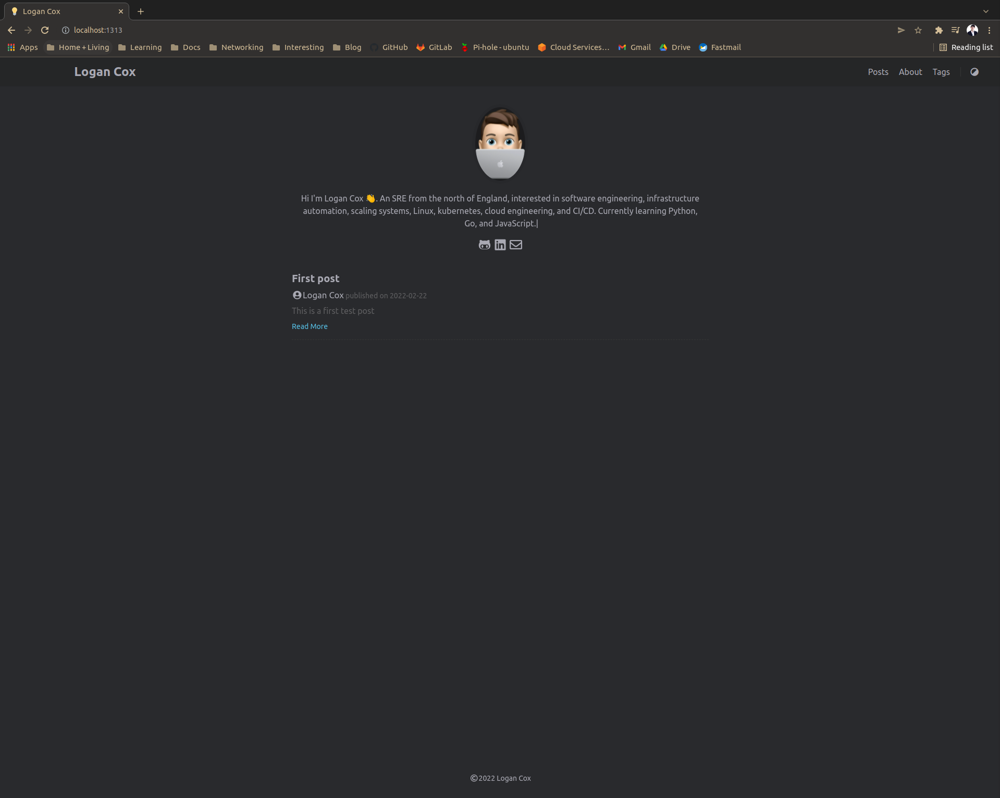
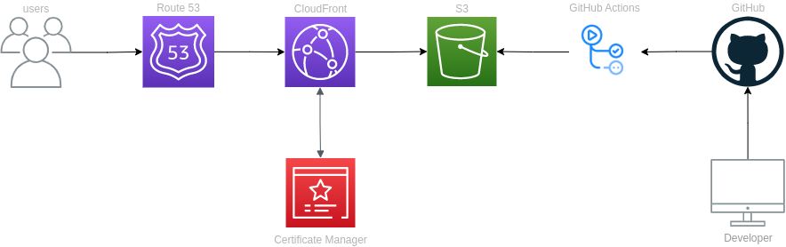

# personal_site
A personal site to hold information about myself and blog posts

## Creating a serverless website using AWS, GitHub and Pullumi.
I wanted to create a personal website where I could display information about myself and post technical writing surrounding technologies or ideas I am interested in. For me the site had to be serverless, easy to manage posts and have fully automated deployments. The advantage of this is the less time I have to spend building the website or managing servers the more time I can spend on developing my engineering skills or studying for various certifications. This first led me to Hugo. A lightweight static site generator written in Go that allows me to control the site through markdown files and a configuration.toml file! On build Hugo will publish an artifact to `public/` in your site root directory. This is the contents for your static site and where your index.html will be placed. In fact, it's where you are reading this post from now.

So now I have a framework. I've met some of my requirements outlined in my introduction. I still needed a serverless platform to deploy to. Amazon S3 meets the requirement in this scenario, whilst it is traditionally only used for object level cloud storage it also has a Static website hosting setting for your S3 bucket. We can store our artifact produced by Hugo in a bucket and have S3 serve the contents. This works because the contents of this bucket are static web content. Anything that utilizes server-side processing such as PHP or Python would not be usable with this feature. 

For deployments I can use the same platform where I am storing the source code for this website, GitHub. I can use the actions feature of GitHub to create automations that will run our Hugo build and then push our contents to our S3 Bucket. 

During our deployment I also want to out our infrastructure then deploy our content to the bucket. For this I opted for Pulumi, an infrastructure as code tool to manage my resources in AWS. This tool will allow us to define our infrastructure in Python.


## Installing and configuring Hugo
I needed to install Hugo and its dependencies locally on my device. Go is a dependency of Hugo so we will need that . Download the .tar.gz file from the golang web page and run
```bash
rm -rf /usr/local/go && tar -C /usr/local -xzf go1.17.7.linux-amd64.tar.gz
```
Add the Go binary to to your path, its best to add this to your `.bash_profile`
```bash
export PATH=$PATH:/usr/local/go/bin
```

Installing Hugo 
``` bash
mkdir $HOME/src
cd $HOME/src
git clone https://github.com/gohugoio/hugo.git
cd hugo
go install --tags extended
```

After installing hugo and configuring my theme by  adding several configurations to my `config.toml` in the root of the site.  I am able to write posts in  mark down, this is made even easier by running `hugo new posts/post.md`. This made it fast to get the site up and running fast. I can then test the configurations with `hugo serve` and run the site locally on the default hugo port so when I navigate to `127.0.0.1:1313` I am presented with my live site with my first post.

### First result
As you can see from the minimal setup I have the ability to post content to my site with a nice theme.

